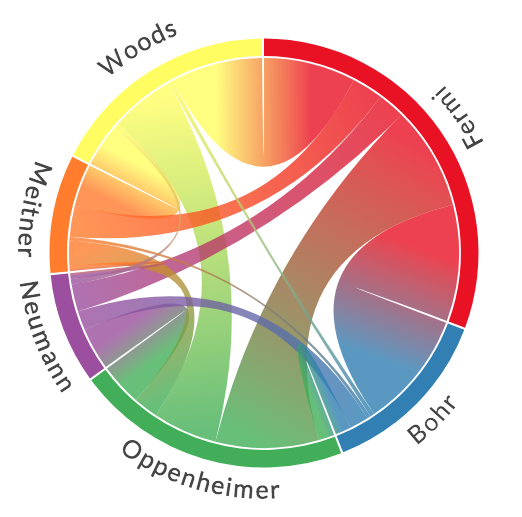

# MetaViz - Media Metadata Visualization Library
**Repository of tools to interface with, visualize, and edit the metadata information in a collection or archive of visual media (i.e. photos and videos).**

For more information about how to use this library and what it can do, please refer to the [examples](https://github.com/wrightky/MetaViz/examples).

## About
Codes and tools in this repository are all built in Python -- however, to access file metadata, we require a local installation of the free perl library [`exiftool`](https://exiftool.org/). All interfacing between this library and exiftool is done through the bash shell, so this is not a sophisticated Python wrapper for any of the exiftool functionality. Rather, MetaViz is a library of surface-layer, user-friendly codes and tools to interface with the metadata in a collection of visual media. We provide functions to search/filter through the metadata in your library to find information you're interested in, update that metadata as needed, and we provide tons of good looking, ready-to-use plotting routines for visualizing that information.

We try to keep these functions quick by minimizing our calls to exiftool, which can be computationally expensive for large media collections. To do this, we use exiftool to save all the metadata information for your library into a *'metadatabase'* of `.csv` files, and then use [`Pandas`](https://pandas.pydata.org/docs/index.html) to directly access and process that information in Python. To create figures and visualizations, we require at minumum an installation of [`matplotlib`](https://matplotlib.org/stable/index.html), with many optional plotting routines that make use of other popular libraries like [`seaborn`](https://seaborn.pydata.org/index.html) and [`Pillow`](https://pillow.readthedocs.io/en/stable/index.html). Our goal is that the aesthetic adjustments made behind the scenes in the plotting routines will provide nice, good-looking visualizations right out of the box -- or, at minimum, example functions that can be used as starting points to make your own.

We also provide a number of [tools](https://github.com/wrightky/MetaViz/tools.py) which can help to generally manage collections or their metadata. These are helper functions that could be useful. Example applications include shifting a list of dates by a constant time-delta, stitching together panoramic photos, and geocoding photos based on their location name.

## Example Figures
Examples of these visualizations can be seen below and in the [gallery](https://github.com/wrightky/MetaViz/tree/main/gallery) folder.

  
   
  

  
   

  

## Installation
MetaViz has been tested in Python 3.6+, and should work in any version of Python in which the underlying packages work. To install MetaViz, clone this repository using `git clone` and run `python setup.py install` from the cloned directory. **In order to use MetaViz, the local environment must include at minimum `numpy`, `Pandas`, and `matplotlib`, along with a functioning installation of [`exiftool`](https://exiftool.org/install.html)**. We also strongly recommend the use of [`Jupyter Lab`](https://jupyterlab.readthedocs.io/en/stable/getting_started/installation.html). In order to use the full suite of tools and functions available, the optional packages we use for select functions are listed below. All links go to the relevant install page.

### Optional Packages:
- [`seaborn`](https://seaborn.pydata.org/installing.html)
- [`Pillow`](https://pillow.readthedocs.io/en/stable/installation.html)
- [`chord`](https://pypi.org/project/chord/) (requires [`Jupyter Lab`](https://jupyterlab.readthedocs.io/en/stable/getting_started/installation.html))
- [`OpenCV`](https://pypi.org/project/opencv-python/)

## Contributing

We welcome contributions to the MetaViz project. Please open an issue or a pull request if there is functionality you would like to see or propose, and I will gladly try to help!
